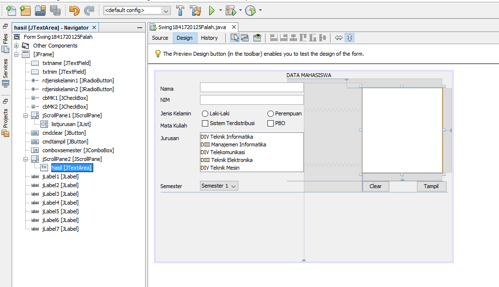

# Laporan Praktikum # 11 - GUI (Graphical User Interface)

## Kompetensi
Setelah menyelesaikan lembar kerja ini mahasiswa diharapkan mampu:

1. Membuat aplikasi Graphical User Interface sederhana dengan bahasa pemrograman java;

2. Mengenal komponen GUI seperti frame, label, textfield, combobox, radiobutton, checkbox, textarea, menu, serta table;

3. Menambahkan event handling pada aplikasi GUI.

## Ringkasan Materi
Di Jobsheet ini Kita Dapat memahami dan mengerti bagaimana cara Membuat aplikasi Graphical User Interface sederhana dengan bahasa pemrograman java, Mengenal komponen GUI seperti frame, label, textfield, combobox, radiobutton,checkbox, textarea, menu, serta table, dan Menambahkan event handling pada aplikasi GUI.

# Percobaan

## Percobaan 1 – JFrame HelloGUI

[HelloGui1841720125Falah](../../src/11_GUI/HelloGui1841720125Falah.java)

## Percobaan 2 – Menangani Input Pada GUI

[HelloGui1841720125Falah](../../src/11_GUI/HelloGui1841720125Falah.java)

### Pertanyaan Percobaan 2

Modifikasi kode program dengan menambahkan JButton baru untuk melakukan fungsi perhitungan penambahan, sehingga ketika button di klik (event click) maka akan menampilkan hasil penambahan dari nilai A dan B

Jawab:

[HelloGui1841720125Falah](../../src/11_GUI/HelloGui1841720125Falah.java)

## Percobaan 3 – Manajemen Layout

[Border1841720125Falah](../../src/11_GUI/Border1841720125Falah.java)

[Grid1841720125Falah](../../src/11_GUI/Grid1841720125Falah.java)

[Box1841720125Falah](../../src/11_GUI/Box1841720125Falah.java)

[LayoutGui1841720125Falah](../../src/11_GUI/LayoutGui1841720125Falah.java)

### Pertanyaan Percobaan 3 

1. Apa perbedaan dari Grid Layout, Box Layout dan Border Layout?
> jawab : 
    •	Grid menampilkan angka-nya menggunakan tata letak kanan dan kiri 
    •	Border menampilkan angkanya sesuai dengan table border yang telah        dibuat dan telah diatur 
    •	BOX menampilkan angkanya terdapat pada box nya masing masing dan         menampilkan angkanya horizontal atau kebawah

2. Apakah fungsi dari masing-masing kode berikut?
> jawab : 
        Karena objek pEmp dan eBill merupakan object dari class yang mengimplements dari class Payable. 

## Percobaan 4 – Membuat GUI Melalui IDE Netbeans

[Swing1841720125Falah](../../src/11_GUI/Swing1841720125Falah.java)

### Pertanyaan Percobaan 4 
1. Apakah fungsi dari kode berikut?
> jawab : 
        •	menampilkan dari JFrame form

2. Mengapa pada bagian logika checkbox dan radio button digunakan multiple if ?
> jawab :
        •	Digunakan untuk pengecekkan pada checkbox dicentang atau tidaknya

3. Lakukan modifikasi pada program untuk melakukan menambahkan inputan berupa alamat dan berikan fungsi pemeriksaan pada nilai Alamat tersebut jika belum diisi dengan menampilkan pesan peringatan
> jawab :
    •	if (!txtAlamat.equals("")) {
            alamat = txtAlamat.getText().toString();
            3
        }
            jurusan = listJurusan.getSelectedValue().toString();
            semester = comboSemester.getSelectedItem().toString();
        if (alamat.equals("") || alamat.equals(null)) {
            JOptionPane.showMessageDialog(null, "Harap isi kolom alamat");
        } else {
            info = "Nama: " + name + "\n";
            info += "NIM: " + nim + "\n";
            info += "Jenis Kelamin: " + jenisKelamin + "\n";
            info += "Jurusan: " + jurusan + "\n";
            info += "Semster: " + semester + "\n";
            info += "Mata Kuliah: " + mataKuliah + "\n";
            info += "Alamat: " + alamat + "";
            hasil.setText(info);
            JOptionPane.showMessageDialog(null, info);
        }

## Percobaan 5 – JTabPane, JTtree, JTable

[Swing21841720125Falah](../../src/11_GUI/Swing21841720125Falah.java)

[Swing21841720125Falah](../../src/11_GUI/Swing21841720125Falah.java)

## Tugas

## Kesimpulan

Di Jobsheet ini Kita Dapat memahami dan mengerti bagaimana cara Membuat aplikasi Graphical User Interface sederhana dengan bahasa pemrograman java, Mengenal komponen GUI seperti frame, label, textfield, combobox, radiobutton,checkbox, textarea, menu, serta table, dan Menambahkan event handling pada aplikasi GUI.

## Pernyataan Diri

Saya menyatakan isi tugas, kode program, dan laporan praktikum ini dibuat oleh saya sendiri. Saya tidak melakukan plagiasi, kecurangan, menyalin/menggandakan milik orang lain.

Jika saya melakukan plagiasi, kecurangan, atau melanggar hak kekayaan intelektual, saya siap untuk mendapat sanksi atau hukuman sesuai peraturan perundang-undangan yang berlaku.

Ttd,

***(AHMAD FALAH SABILA)***
