# Laporan Praktikum # 12 - Collection (List, Set, Map) dan Database

## Kompetensi
Setelah menyelesaikan lembar kerja ini mahasiswa diharapkan mampu:

 Memahami cara penyimpanan objek menggunakan Collection dan Map.
 Mengetahui pengelompokan dari Collection.
 Mengetahui perbedaan dari interface Set, List dan Map.
 Mengetahui penggunaan class-class dari interface Set, List, dan Map.
 Memahami koneksi database menggunakan JDBC dan JDBC API

## Ringkasan Materi
Di Jobsheet ini Kita Dapat memahami dan mengerti bagaimana cara  penyimpanan objek menggunakan Collection dan Map, Mengetahui pengelompokan dari Collection, Mengetahui perbedaan dari interface Set, List dan Map, Mengetahui penggunaan class-class dari interface Set, List, dan Map, dan Memahami koneksi database menggunakan JDBC dan JDBC API

# Percobaan

## Percobaan 1 – (Set)

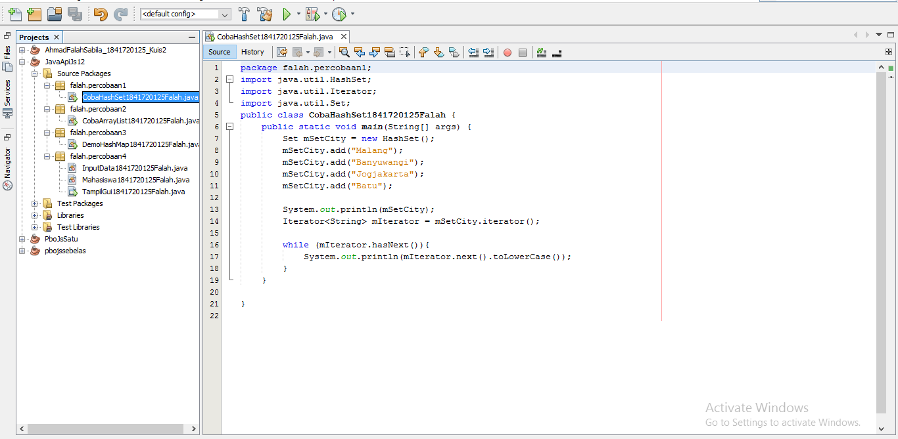

[CobaHashSet1841720125Falah](../../src/12_Java_API/CobaHashSet1841720125Falah.java)

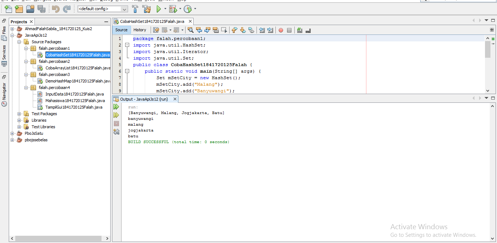

### Pertanyaan Percobaan 1

#### Soal:

1. Apakah fungsi import java.util.*; pada program diatas!
2. Pada baris program keberapakah yang berfungsi untuk menciptakan object HashSet?
3. Apakah fungsi potongan program dibawah ini pada percobaan 1!
4. Tambahkan set.add(“Malang”); kemudian jalankan program! Amati hasilnya dan jelaskan mengapa terjadi error!
5. Jelaskan fungsi potongan program dibawah ini pada percobaan 1!

##### Jawaban:
1. Untuk mengimpor semua kelas di dalam java.
2. Pada baris ke-18."Set mSetCity = new HashSet();
3. Untuk menambahkan objek kedalam HashSet()
4. Karena nama objek yang seharusnya adalah mSetCity. Jika mengunakan set maka program tidak mengenali objek tersebut.
5. Iterator digunakan untuk mengakses dan menampilkan nilai beserta tambahan ethod lalin yang didefinisikan di dalam interface Iterator.

## Percobaan 2 – (List)

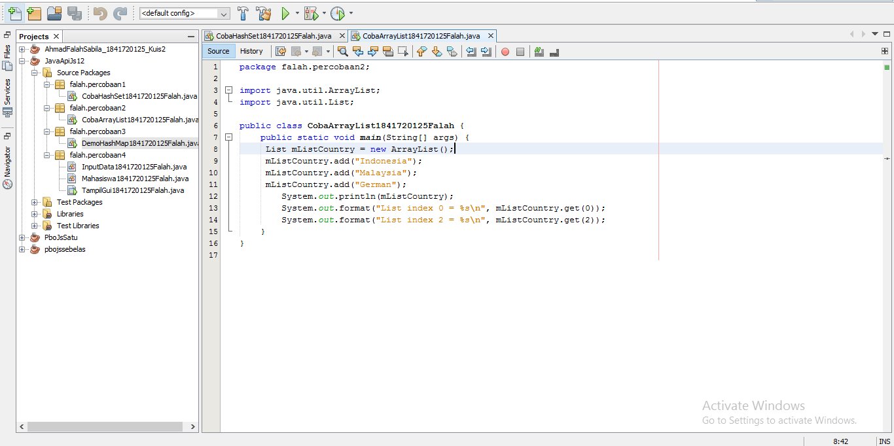

[CobaArrayList1841720125Falah](../../src/12_Java_API/CobaArrayList1841720125Falah.java)

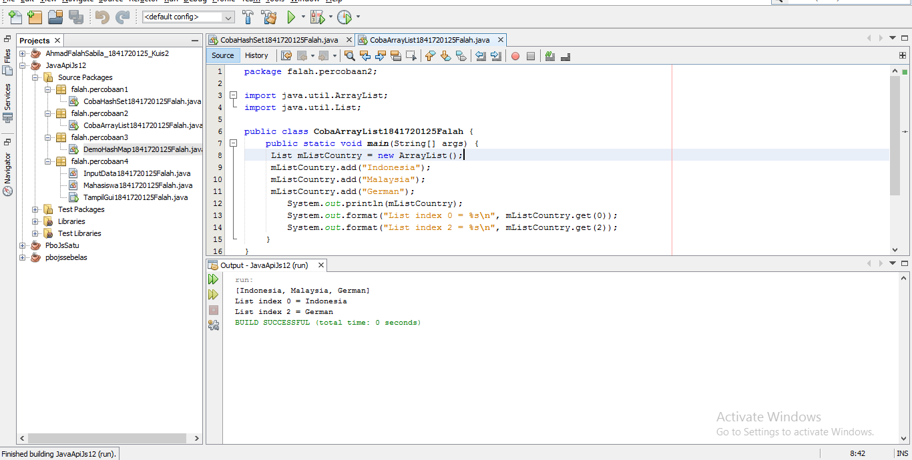

### Pertanyaan Percobaan 2

#### Soal:
1. Apakah fungsi potongan program dibawah ini!
2. Ganti potongan program pada soal no 1 menjadi sebagai berikut, Kemudian jalankan program tersebut!
3. Jelaskan perbedaan menampilkan data pada ArrayList menggunakan potongan program pada
soal no 1 dan no 2!

##### Jawaban:
1.  Untuk menampilkan nilai dari mListCountry dan menampilkan data mListCountry index ke 0 dan index ke 2.
2. Country List
   Indonesia Malaysia German
3. Ketika menggunakan potongan program no 1 maka menampilkan data menggunakan list, sedangkan pada potongan program no 2 menampilkan semua data dengan iterator.

## Percobaan 3 – (Map)

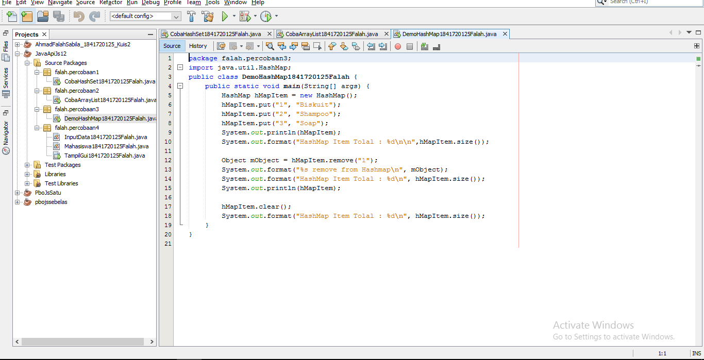

[DemoHashMap1841720125Falah](../../src/12_Java_API/DemoHashMap1841720125Falah.java)

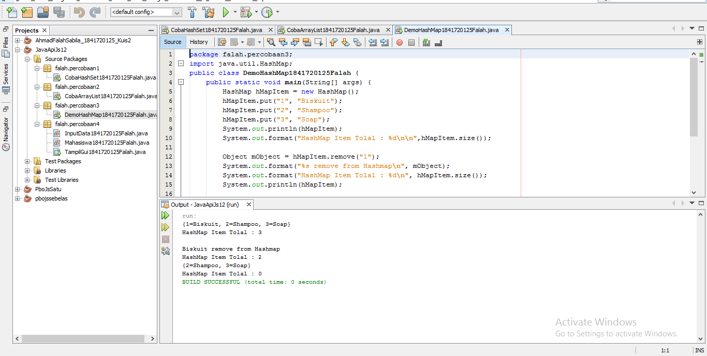

### Pertanyaan Percobaan 3 

#### Soal:
1. Jelaskan fungsi hMapItem.put("1","Biskuit") pada program!
2. Jelaskan fungsi hMapItem.size() pada program!
3. Jelaskan fungsi hMapItem.remove("1") pada program!
4. Jelaskan fungsi hMapItem.clear() pada program!
5. Tambahkan kode program yang di blok pada program yang sudah anda buat!
6. Jalankan program dan amati apa yang terjadi!
7. Apakah perbedaan program sebelumnya dan setelah ditambahkan kode program pada soal no 5 diatas? Jelaskan!

##### Jawaban:
1.  Untuk menambahkan object dengan key 1 dengan nama biscuit ke dalam object hMapItem pada HashMap().
2. Untuk menampilkan size atau banyak data dari hMapItem.
3. Untuk menghapus item dengan key 1.
4. Untuk menghapus semua data yang ada pada hMapItem.
5. Collection mCollection = hMapItem.values();
    Iterator mIterator = mCollection.iterator();
    while (mIterator.hashNext()){
    System.out.println(mIterator.next());
    }
6. Terdapat penambahan list Biskuit Shampoo dan Soap
7. Setelah ditambahkan kode program tersebut adalah adanya penampilan data menggunakan iterator.

## Percobaan 4 – (Implementasi ArrayList dalam GUI)

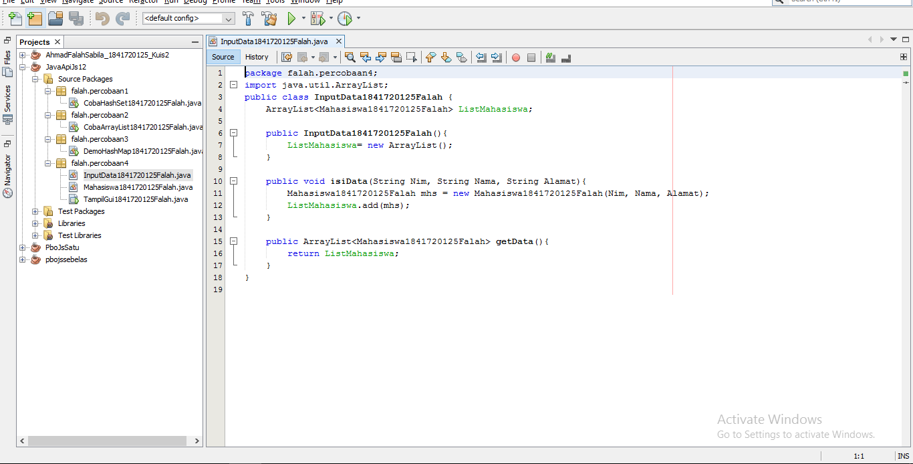

[InputData1841720125Falah](../../src/12_Java_API/InputData1841720125Falah.java)

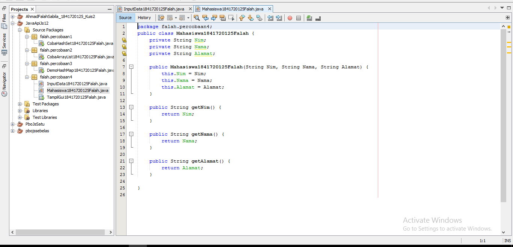

[Mahasiswa1841720125Falah](../../src/12_Java_API/Mahasiswa1841720125Falah.java)

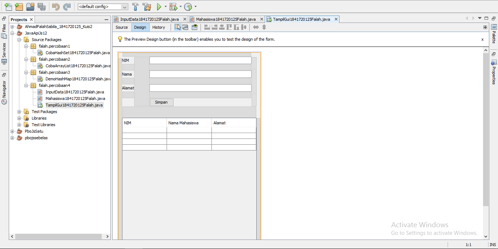

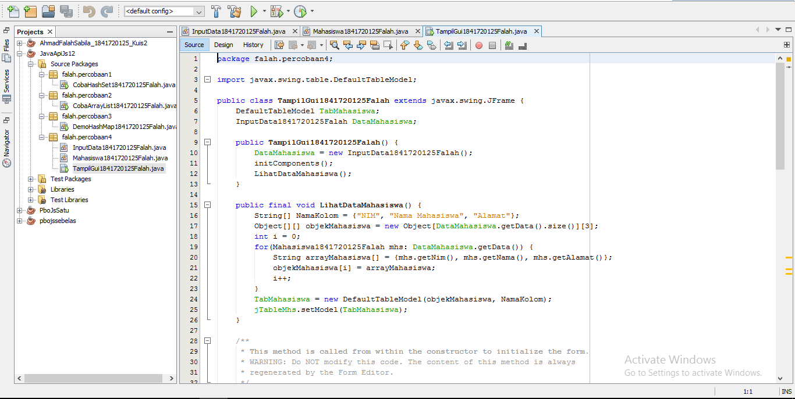

[TampilGui1841720125Falah](../../src/12_Java_API/TampilGui1841720125Falah.java)

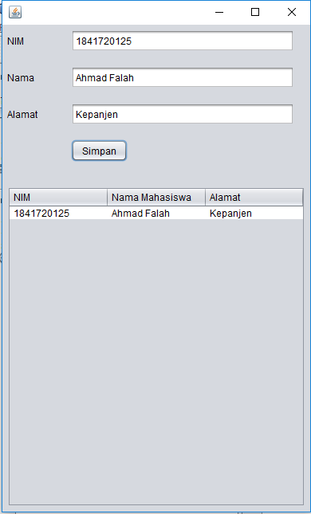

## Percobaan 5 – (Aplikasi Biodata)

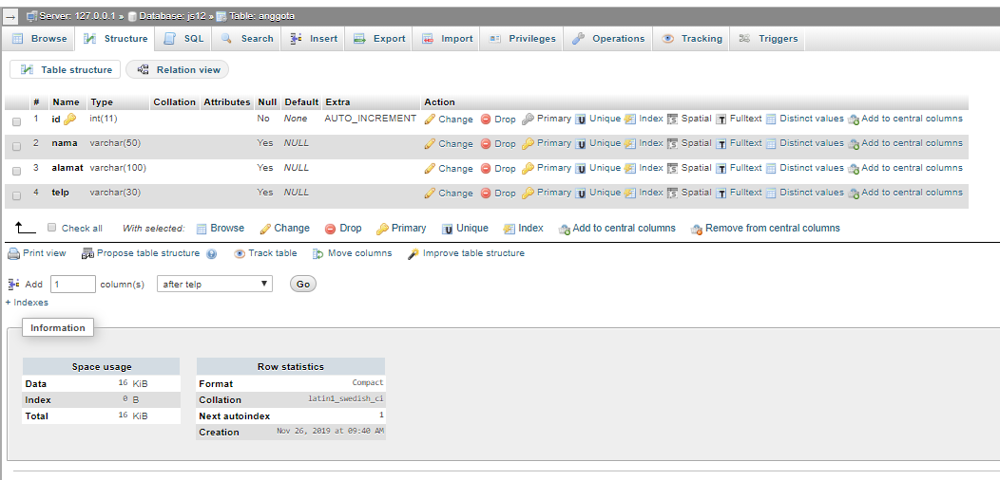

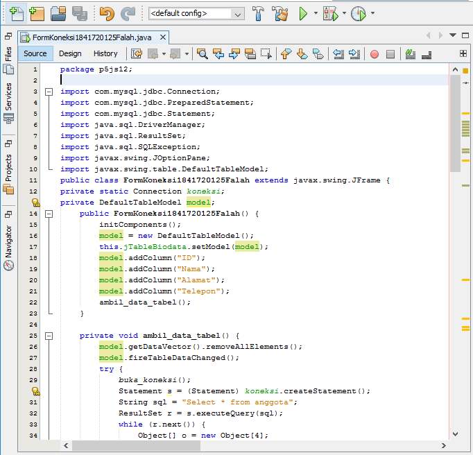

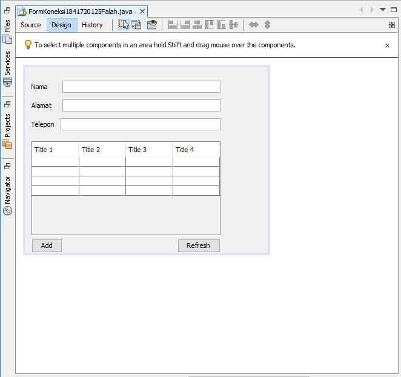

[FormKoneksi1841720125Falah](../../src/12_Java_API/FormKoneksi1841720125Falah.java)

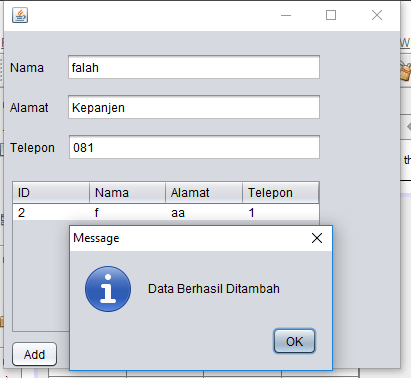

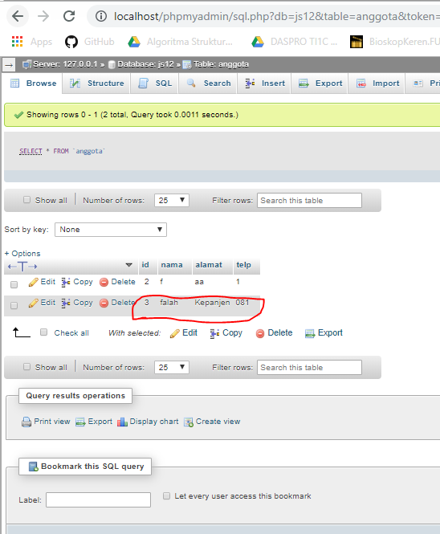

5. Setelah menambah code pada action button klik, coba jalankan program dan tambahkan
data. Apakah program berhasil menambahkan data? Jika tidak apakah penyebabnya.

Jawab: 

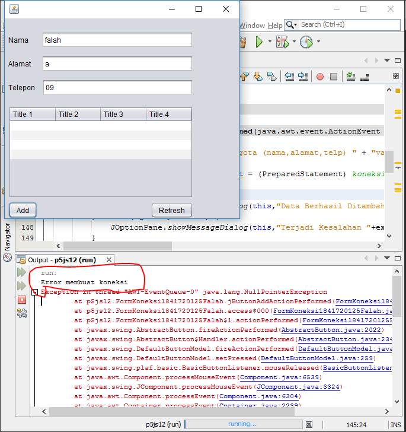

6. Jelaskan maksud source code untuk melakukan insert data diatas?

Jawab:
untuk menambahkan data pada database yang selanjutnya akan ditampilkan pada java tersebut

9. Jelaskan alur dari method ambil_data_tabel?

Jawab:
setelah menambahkan data lalu masuk ke dalam database yang selanjutnya oleh java akan diambil dengan menggunakan sintaks select*from

## Kesimpulan

Di Jobsheet ini Kita Dapat memahami dan mengerti bagaimana cara  penyimpanan objek menggunakan Collection dan Map, Mengetahui pengelompokan dari Collection, Mengetahui perbedaan dari interface Set, List dan Map, Mengetahui penggunaan class-class dari interface Set, List, dan Map, dan Memahami koneksi database menggunakan JDBC dan JDBC API

## Pernyataan Diri

Saya menyatakan isi tugas, kode program, dan laporan praktikum ini dibuat oleh saya sendiri. Saya tidak melakukan plagiasi, kecurangan, menyalin/menggandakan milik orang lain.

Jika saya melakukan plagiasi, kecurangan, atau melanggar hak kekayaan intelektual, saya siap untuk mendapat sanksi atau hukuman sesuai peraturan perundang-undangan yang berlaku.

Ttd,

***(AHMAD FALAH SABILA)***
