# Laporan Praktikum #2 - Class dan Object

## Kompetensi

Setelah menempuh materi percobaan ini, mahasiswa mampu mengenal: 
Mahasiswa dapat memahami deskripsi dari class dan object
  Mahasiswa memahami implementasi dari class
  Mahasiswa dapat memahami implementasi dari attribute
  Mahasiswa dapat memahami implementasi dari method
  Mahasiswa dapat memahami implementasi dari proses instansiasi
  Mahasiswa dapat memahami implementasi dari try-catch
  Mahasiswa dapat memahami proses pemodelan class diagram menggunakan UML
 

## Ringkasan Materi
 Di Jobsheet ini Kita Dapat memahami bagaimana cara meng-implementasikan attribute,method, proses instansiasi, try-catch, dan bagaimana cara pemodelan class diagram menggunakan UML

## Percobaan

## Percobaan 1

    Studi Kasus 1: Dalam suatu perusahaan salah satu data yang diolah adalah data karyawan. Setiap karyawan memiliki id, nama, jenis kelamin, jabatan, jabatan, dan gaji. Setiap mahasiswa juga bisa menampilkan data diri pribadi dan melihat gajinya. 

### 1.	Gambarkan desain class diagram dari studi kasus 1! 
 a.	Desain class diagram karyawan

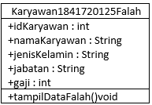

### 2.	Sebutkan Class apa saja yang bisa dibuat dari studi kasus 1! 

    •	Class Karyawan1841720125Falah

    •	Class TestKaryawan1841720125Falah

### 3.	Sebutkan atribut beserta tipe datanya yang dapat diidentifikasi dari masing-masing class dari studi kasus 1! 
Atribut dan tipe data : 

    •	idKaryawan : int

    •	namaKaryawan : String

    •	jenisKelamin : String

    •	jabatan : String

    •	gaji : int

### 4.	Sebutkan method-method yang sudah anda buat dari masing-masing class pada studi kasus 1!
Method : 

    •	tampilDataFalah();

## Percobaan 2
1.	Jelaskan pada bagian mana proses pendeklarasian atribut pada program diatas!
Jawab : 

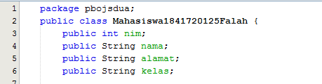

2.	Jelaskan pada bagian mana proses pendeklarasian method pada program diatas!
Jawab :

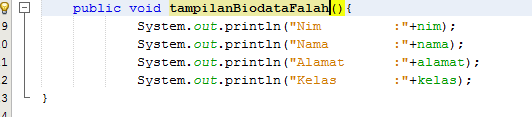

3.	Berapa banyak objek yang di instansiasi pada program diatas!
Jawab : 

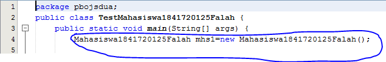

        Objek yang diinstansiasi hanya 1 yaitu mhs 1 

4.	Apakah yang sebenarnya dilakukan pada sintaks program “mhs1.nim=101” ?
Jawab : 

        Untuk mengisikan nilai data nim yang mempunyai nilai "101"

5.	Apakah yang sebenarnya dilakukan pada sintaks program “mhs1.tampilBiodata()” ?
Jawab : 

        Untuk memanggil method tampilBiodataFalah(); untuk menampilkan hasil biodata mahasiswa, agar ditampilkan waktu output.

6.	Instansiasi 2 objek lagi pada program diatas!
Jawab : 

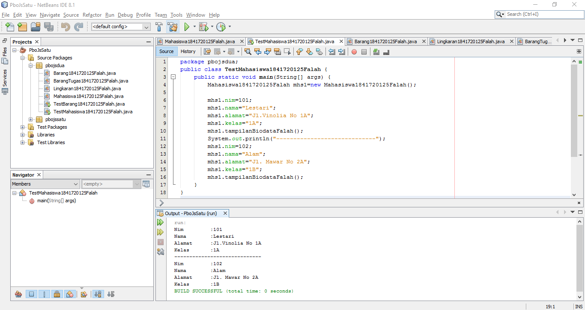

## Percobaan 3

1.	Apakah fungsi argumen dalam suatu method?
Jawab : 

        memberikan nilai yang harus dieksekusi dalam method tersebut.

2.	Ambil kesimpulan tentang kegunaan dari kata kunci return , dan kapan suatu method harus memiliki return!
Jawab : 

        Return digunakan untuk tipe data int karena untuk mengembalikan nilai int.

## Tugas

1.	Suatu toko persewaan video game salah satu yang diolah adalah peminjaman, dimana data yang dicatat ketika ada orang yang melakukan peminjaman adalah id, nama member, nama game, dan harga yang harus dibayar. Setiap peminjaman bisa menampilkan data hasil peminjaman dan harga yang harus dibayar. Buatlah class diagram pada studi kasus diatas! 

Penjelasan: 

•	Harga yang harus dibayar diperoleh dari lama sewa x harga. 

•	Diasumsikan 1x transaksi peminjaman game yang dipinjam hanya 1 game saja.

Jawab : 

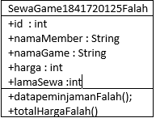

2.	Buatlah program dari class diagram yang sudah anda buat di no 1!
Jawab : 

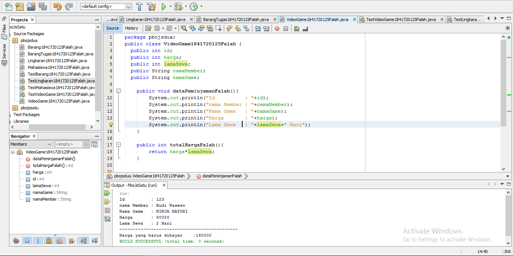

Contoh link kode program : [VideoGame1841720125Falah](../../src/2_Class_dan_Object/VideoGame1841720125Falah.java)

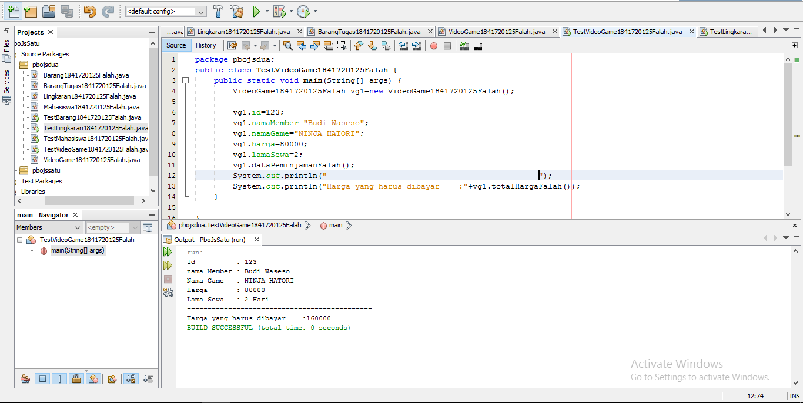

Contoh link kode program : [TestVideoGame1841720125Falah](../../src/2_Class_dan_Object/VideoGame1841720125Falah.java)

3.	Buatlah program sesuai dengan class diagram berikut ini:

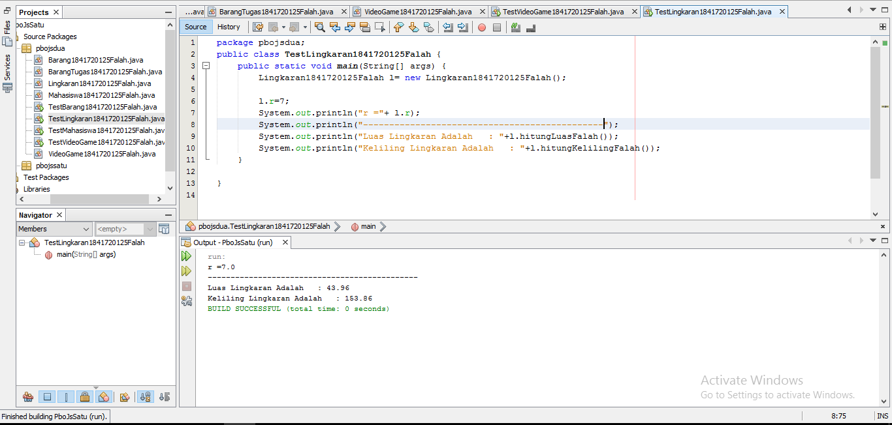

Contoh link kode program : [TestLingkaran1841720125Falah](../../src/2_Class_dan_Object/TestLingkaran1841720125Falah.java)

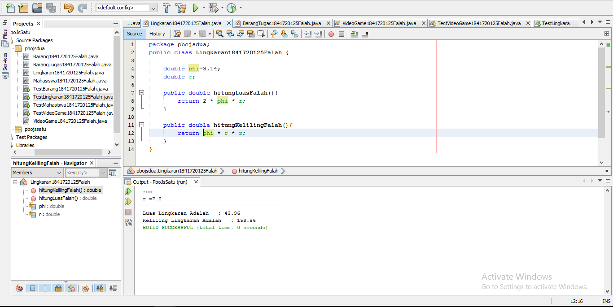

Contoh link kode program : [Lingkaran1841720125Falah](../../src/2_Class_dan_Object/Lingkaran1841720125Falah.java)

4.	Buatlah program sesuai dengan class diagram berikut ini: 
 
 Deskripsi / Penjelasan : 
 Nilai atribut hargaDasar dalam Rupiah dan atribut diskon dalam % 
 Method hitungHargaJual() digunakan untuk menghitung harga jual dengan perhitungan berikut ini: harga jual = harga dasar – (diskon x harga dasar)

Jawab : 

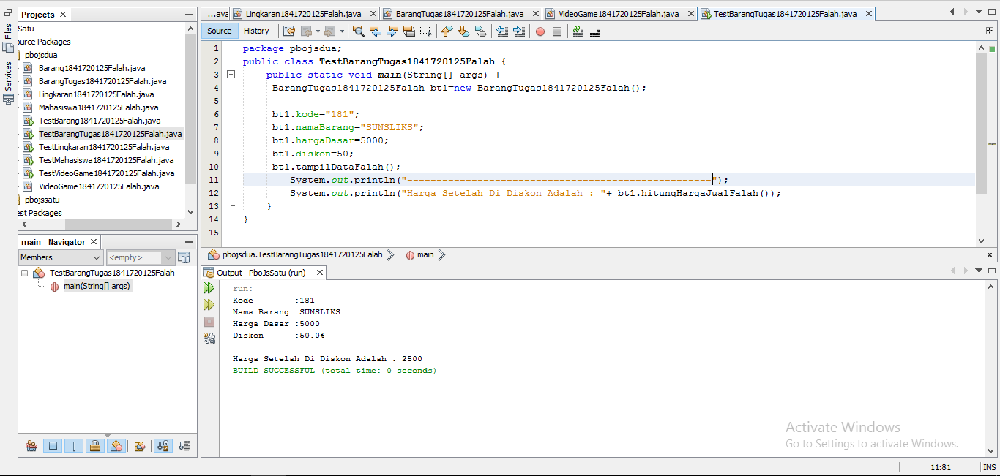

Contoh link kode program : [TestBarangTugas1841720125Falah](../../src/2_Class_dan_Object/TestBarangTugas1841720125Falah.java)

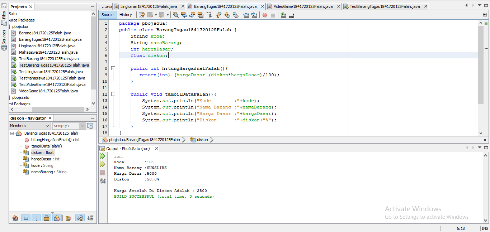

Contoh link kode program : [BarangTugas1841720125Falah](../../src/2_Class_dan_Object/BarangTugas1841720125Falah.java)

## Kesimpulan

Dari percobaan diatas, kita telah mendemonstrasikan bagaimana memahami deskripsi dari class dan object Mahasiswa memahami implementasi dari class, Mahasiswa dapat memahami implementasi dari attribute, Mahasiswa dapat memahami implementasi dari method, Mahasiswa dapat memahami implementasi dari proses instansiasi, Mahasiswa dapat memahami implementasi dari try-catch, Mahasiswa dapat memahami proses pemodelan class diagram menggunakan UML

## Pernyataan Diri

Saya menyatakan isi tugas, kode program, dan laporan praktikum ini dibuat oleh saya sendiri. Saya tidak melakukan plagiasi, kecurangan, menyalin/menggandakan milik orang lain.

Jika saya melakukan plagiasi, kecurangan, atau melanggar hak kekayaan intelektual, saya siap untuk mendapat sanksi atau hukuman sesuai peraturan perundang-undangan yang berlaku.

Ttd,

***(AHMAD FALAH SABILA)***
