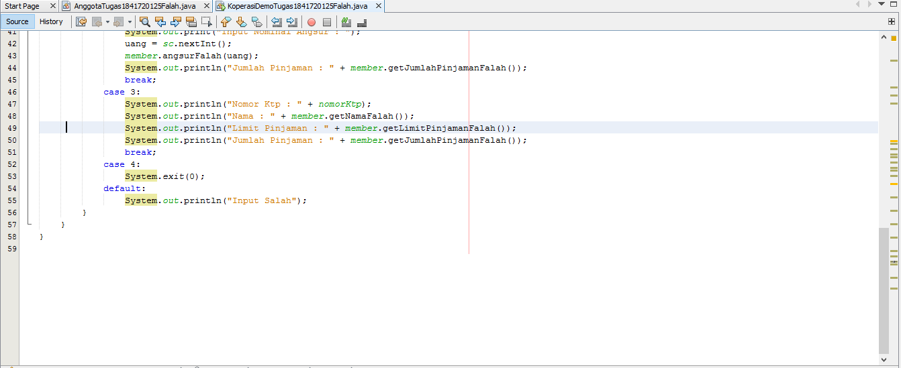

# Laporan Praktikum #3 - Enkapsulasi

## Kompetensi

Setelah melakukan percobaan pada modul ini, mahasiswa memahami konsep:
1. Konstruktor
2. Akses Modifier
3. Atribut/method pada class
4. Intansiasi atribut/method
5. Setter dan getter
6. Memahami notasi pada UML Class Diagram
 

## Ringkasan Materi
 Di Jobsheet ini Kita Dapat memahami dan mengerti bagaimana cara penggunaan konstruktor, akses modifier, atribut/method pada class, instansiasi atribut/method, getter dan setter, serta memahami notasi pada UML class diagram.

## Percobaan

## Percobaan 1 Enkapsulasi

Didalam percobaan enkapsulasi, buatlah class Motor yang memiliki atribut kecepatan dan kontakOn, dan memiliki method printStatus() untuk menampilkan status motor. Seperti berikut
1. Buka Netbeans, buat project MotorEncapsulation.
2. Buat class Motor. Klik kanan pada package motorencapsulation – New – Java Class.
3. Ketikkan kode class Motor dibawah ini.

bentuk UML class diagram class Motor adalah sebagai berikut:

Contoh link kode program : [Motor1841720125Falah](../../src/3_Enkapsulasi/Motor1841720125Falah.java)

Contoh link kode program : [MotorDemo1841720125Falah](../../src/3_Enkapsulasi/MotorDemo1841720125Falah.java)

Dari percobaan 1 - enkapsulasi, menurut anda, adakah yang janggal?

Yaitu, kecepatan motor tiba-tiba saja berubah dari 0 ke 50. Lebih janggal lagi, posisi kontak motor masih dalam kondisi OFF. Bagaimana mungkin sebuah motor bisa sekejap berkecepatan dari nol ke 50, dan itupun kunci kontaknya OFF?

Nah dalam hal ini, akses ke atribut motor ternyata tidak terkontrol. Padahal,objek di dunia nyata selalu memiliki batasan dan mekanisme bagaimana objek tersebut dapat digunakan. Lalu, bagaimana kita bisa memperbaiki class Motor diatas agar dapat digunakan dengan baik? Kita bisa pertimbangkan beberapa hal berikut ini:

1. Menyembunyikan atribut internal (kecepatan, kontakOn) dari pengguna (class lain)

2. Menyediakan method khusus untuk mengakses atribut.
Untuk itu mari kita lanjutkan percobaan berikutknya tentang Access Modifier.

## Percobaan 2 Access Modifier
Pada percobaan ini akan digunakan access modifier untuk memperbaiki cara kerja class Motor pada percobaan ke-1.

1. Ubah cara kerja class motor sesuai dengan UML class diagram berikut.

2. Berdasarkan UML class diagram tersebut maka class Motor terdapat perubahan, yaitu:

a. Ubah access modifier kecepatan dan kontakOn menjadi private

b. Tambahkan method nyalakanMesin, matikanMesin, tambahKecepatan, kurangiKecepatan.

Implementasi class Motor adalah sebagai berikut:

Contoh link kode program : [Motor1841720125Falah](../../src/3_Enkapsulasi/Motor1841720125Falah.java)

3. Kemudian pada class MotorDemo, ubah code menjadi seperti berikut:

Jawab : 

Contoh link kode program : [MotorDemo1841720125Falah](../../src/3_Enkapsulasi/MotorDemo1841720125Falah.java)

Dari percobaan diatas, dapat kita amati sekarang atribut kecepatan tidak bisa diakses oleh pengguna dan diganti nilainya secara sembarangan.

Bahkan ketika mencoba menambah kecepatan saat posisi kontak masih OFF, maka akan muncul notifikasi bahwa mesin OFF.

Untuk mendapatkan kecepatan yang diinginkan, maka harus dilakukan secara gradual, yaitu dengan memanggil method tambahKecepatan() beberapa kali.

Hal ini mirip seperti saat kita mengendarai motor.

## Pertanyaan

1. Pada class TestMobil, saat kita menambah kecepatan untuk pertama kalinya, mengapa muncul peringatan “Kecepatan tidak bisa bertambah karena Mesin Off!”?

2. Mengapat atribut kecepatan dan kontakOn diset private?

3. Ubah class Motor sehingga kecepatan maksimalnya adalah 100!

Jawaban:

1. Karena status kontak masih off, Untuk dapat menambah kita harus menyalakannya terlebih dahulu.

2. Agar atribut kecepatan pada class Motor1841720125Falah.java tidak bisa diganti nilainya kecuali dengan method khusus pada class MotorDemo1841720125Falah.java

3. Rubah nilai kecepatan menjadi 90, agar saat tambah kecepatan dijalankan dapat mengetahui keberhasilan dari kode program

Edit method tambahKecepatanFalah() seperti gambar dibawah ini

Lalu edit MotorDemo.java seperti gambar dibawah

Contoh link kode program : [Motor1841720125Falah](../../src/3_Enkapsulasi/Motor1841720125Falah.java)

Contoh link kode program : [MotorDemo1841720125Falah](../../src/3_Enkapsulasi/MotorDemo1841720125Falah.java)

## Percobaan 3 Getter dan Setter
Misalkan di sebuah sistem informasi koperasi, terdapat class Anggota. 
Anggota memiliki atribut nama, alamat dan simpanan, dan method setter, getter dan setor dan pinjam. Semua atribut pada anggota tidak boleh diubah sembarangan, melainkan hanya dapat diubah melalui method setter, getter, setor dan tarik. Khusus untuk atribut simpanan tidak terdapat setter karena simpanan akan bertambah ketika melakukan transaksi setor dan akan berkurang ketika melakukan peminjaman/tarik.

1. Berikut ini UML class buatlah class Mahasiswa pada program:

2. Sama dengan percobaan 1 untuk membuat project baru

a. Buka Netbeans, buat project KoperasiGetterSetter.

b. Buat class Anggota. Klik kanan pada package koperasigettersetter – New – Java Class.

c. Ketikkan kode class Anggota dibawah ini.

Contoh link kode program : [Anggota1841720125Falah](../../src/3_Enkapsulasi/Anggota1841720125Falah.java)

Jika diperhatikan pada class Anggota, atribut nama dan alamat memili masing-masing 1 getter dan setter. Sedangkan atribut simpanan hanya memiliki getSimpananFalah() saja, karena seperti tujuan awal, atribut simpanan akan berubah nilainya jika melakukan transaksi setorFalah() dan pinjam/tarikFalah().

3. Selanjutnya buatlah class KoperasiDemo untuk mencoba class Anggota.

Contoh link kode program : [KoperasiDemo1841720125Falah](../../src/3_Enkapsulasi/KoperasiDemo1841720125Falah.java)

## Percobaan 4 Konstruktor, Instansiasi

1. Langkah pertama percobaan 4 adalah ubah class KoperasiDemo seperti berikut:

2. Hasil dari program tersebut adalah sebagai berikut:

Dapat dilihat hasil running program, ketika dilakukan pemanggilan method getNama() hasilnya hal ini terjadi karena atribut nama belum diset nilai defaultnya. Hal ini dapat ditangani dengan membuat kontruktor.

Contoh link kode program : [KoperasiDemo1841720125Falah](../../src/3_Enkapsulasi/KoperasiDemo1841720125Falah.java)

3. Ubah class Anggota menjadi seperti berikut

Contoh link kode program : [Anggota1841720125Falah](../../src/3_Enkapsulasi/Anggota1841720125Falah.java)

Pada class Anggota1841720125Falah dibuat kontruktor dengan access modifier default yang memiliki 2 parameter nama dan alamat. Dan didalam konstruktor tersebut dipastikan nilai simpanan untuk pertama kali adalah Rp. 0.

4. Selanjutnya ubah class KoperasiDemo sebagai berikut

5. Hasil dari program tersebut adalah sebagai berikut

Setelah menambah konstruktor pada class Anggoata maka atribut nama dan alamat secara otomatis harus diset terlebih dahulu dengan melakukan passing parameter jika melakukan instansiasi class Anggota. Hal ini biasa dilakukan untuk atribut yang membutuhkan nilai yang spesifik. Jika tidak membutuhkan nilai spesifik dalam konstruktor tidak perlu parameter. Contohnya simpanan untuk anggota baru diset 0, maka simpanan tidak perlu untuk dijadikan parameter pada konstruktor.

Contoh link kode program : [KoperasiDemo1841720125Falah](../../src/3_Enkapsulasi/KoperasiDemo1841720125Falah.java)

## Pertanyaan – Percobaan 3 dan 4
1. Apa yang dimaksud getter dan setter?

2. Apa kegunaan dari method getSimpananFalah()?

3. Method apa yang digunakan untk menambah saldo?

4. Apa yand dimaksud konstruktor?

5. Sebutkan aturan dalam membuat konstruktor?

6. Apakah boleh konstruktor bertipe private?

7. Kapan menggunakan parameter dengan passsing parameter?

8. Apa perbedaan atribut class dan instansiasi atribut?

9. Apa perbedaan class method dan instansiasi method?

## Jawaban

1. Getter adalah public method dan memiliki tipe data return, yang berfungsi untuk mendapatkan nilai dari atribut private. Sedangkan setter adalah public method yang tidak memliki tipe data return, yang berfungsi untuk memanipulasi nilai dari atribut private.

2. Merupakan method yang digunakan untuk mendapatkan nilai dari atribut simpanan yang nantinya method tersebut digunkan untuk menampilkan nilai dari atribut simpanan

3. Method setorFalah()

4. Konstruktor mirip dengan method cara deklarasinya akan tetapi tidak memiliki tipe return. Dan konsturktor dieksekusi ketika instan dari objek dibuat. Jadi setiap kali sebuat objek dibuat dengan keyword new() maka konstruktor akan dieksekusi. Atau kalau dari pandangan saya konstruktor merupakan cara untuk menambah parameter pada objek.

5. • Nama konstruktor harus sama dengan nama class

• Konstruktor tidak memiliki tipe data return

• Konstruktor tidak boleh menggunakan modifier abstract, static, final, dan syncronized

6. Tidak, bila private maka objek tidak bisa diakes atau tidak bisa di instansiasi oleh class lain

7. Bila kita menggunakan konstruktor maka sebaiknya kita menggunakan passing parameter dan juga sebaliknya.

8. Class merupakan brueprint dari prototype dari objek, kalau instansiasi dibunakan untuk memanggil sebuah objek dari class yang lain.

9. Method merupakan suatu operasi berupa fungsi-fungsi yang dapat dikerjakan oleh suatu object.

## Tugas

1. Cobalah program dibawah ini dan tuliskan hasil outputnya 

Contoh link kode program : [EncapDemo1841720125Falah](../../src/3_Enkapsulasi/EncapDemo1841720125Falah.java)

Contoh link kode program : [EncapTest1841720125Falah](../../src/3_Enkapsulasi/EncapTest1841720125Falah.java)

2. Pada program diatas, pada class EncapTest kita mengeset age dengan nilai 35, namun pada saat ditampilkan ke layar nilainya 30, jelaskan mengapa.

Jawab : 

Karena pada method setAge terdapat percabangan yang didalamnya berisi bila nilai dari atribut age lebih dari 30 maka nilai age akan menjadi 30

3. Ubah program diatas agar atribut age dapat diberi nilai maksimal 30 dan minimal 18.

Contoh link kode program : [EncapDemo1841720125Falah](../../src/3_Enkapsulasi/EncapDemo1841720125Falah.java)

Contoh link kode program : [EncapTest1841720125Falah](../../src/3_Enkapsulasi/EncapTest1841720125Falah.java)

4. Pada sebuah sistem informasi koperasi simpan pinjam, terdapat class Anggota yang memiliki atribut antara lain nomor KTP, nama, limit peminjaman, dan jumlah pinjaman. Anggota dapat meminjam uang dengan batas limit peminjaman yang ditentukan. Anggota juga dapat mengangsur pinjaman. Ketika Anggota tersebut mengangsur pinjaman, maka jumlah pinjaman akan berkurang sesuai dengan nominal yang diangsur. Buatlah class Anggota tersebut, berikan atribut, method dan konstruktor sesuai dengan kebutuhan. Uji dengan TestKoperasi berikut ini untuk memeriksa apakah class Anggota yang anda buat telah sesuai dengan yang diharapkan.

Contoh link kode program : [AnggotaTugas1841720125Falah](../../src/3_Enkapsulasi/AnggotaTugas1841720125Falah.java)

Contoh link kode program : [KoperasiDemoTugas1841720125Falah](../../src/3_Enkapsulasi/KoperasiDemoTugas1841720125Falah.java)

5. Modifikasi soal no. 4 agar nominal yang dapat diangsur minimal adalah 10% dari jumlah pinjaman saat ini. Jika mengangsur kurang dari itu, maka muncul peringatan “Maaf, angsuran harus 10% dari jumlah pinjaman”.

Contoh link kode program : [KoperasiDemoTugas1841720125Falah](../../src/3_Enkapsulasi/KoperasiDemoTugas1841720125Falah.java)

6. Modifikasi class , KoperasiDemoTugas agar jumlah pinjaman dan angsuran dapat menerima input dari console.

Ubah Source Code dari Class KoperasiDemoTugas.java

Contoh link kode program : [KoperasiDemoTugas1841720125Falah](../../src/3_Enkapsulasi/KoperasiDemoTugas1841720125Falah.java)

## Kesimpulan

Dari percobaan diatas, telah dipelajari kosep dari enkapsulasi, kontruktor, access modifier yang terdiri dari 4 jenis yaitu public, protected, default dan private. Konsep atribut atau method class yang ada di dalam blok code class dan konsep instansiasi atribut atau method. Cara penggunaan getter dan setter beserta fungsi dari getter dan setter. Dan juga telah dipelajari atau memahami notasi UML

## Pernyataan Diri

Saya menyatakan isi tugas, kode program, dan laporan praktikum ini dibuat oleh saya sendiri. Saya tidak melakukan plagiasi, kecurangan, menyalin/menggandakan milik orang lain.

Jika saya melakukan plagiasi, kecurangan, atau melanggar hak kekayaan intelektual, saya siap untuk mendapat sanksi atau hukuman sesuai peraturan perundang-undangan yang berlaku.

Ttd,

***(AHMAD FALAH SABILA)***
