# Laporan Praktikum #6 - Inheritance

## Kompetensi

Setelah menempuh pokok bahasan ini, mahasiswa mampu:

1.	Memahami konsep dasar inheritance atau pewarisan.

2.	Mampu membuat suatu subclass dari suatu superclass tertentu.

3.	Mampu mengimplementasikan konsep single dan multilevel inheritance.

4.	Mampu membuat objek dari suatu subclass dan melakukan pengaksesan terhadap atribut dan method baik yang dimiliki sendiri atau turunan dari superclass nya.

## Ringkasan Materi
 Di Jobsheet ini Kita Dapat Memahami konsep dasar inheritance atau pewarisan Mampu membuat suatu subclass dari suatu superclass tertentu, Mampu mengimplementasikan konsep single dan multilevel inheritance dan Mampu membuat objek dari suatu subclass dan melakukan pengaksesan terhadap atribut dan method baik yang dimiliki sendiri atau turunan dari superclass nya.

## Percobaan 1 Extends

1.	Buatlah sebuah class parent/superclass dengan nama ClassA.java

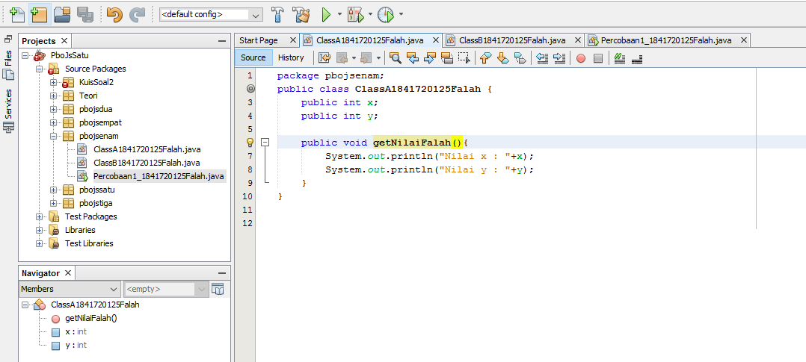

Contoh link kode program : [ClassA1841720125Falah](../../src/6_Inheritance/ClassA1841720125Falah.java)

2.	Buatlah sebuah class anak/subclass dengan nama ClassB.java

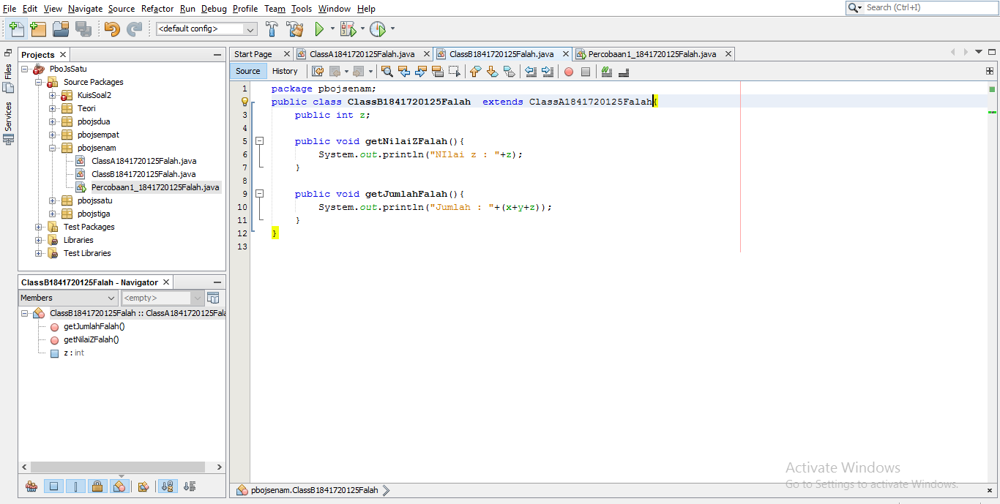

Contoh link kode program : [ClassB1841720125Falah](../../src/6_Inheritance/ClassB1841720125Falah.java)

3.	Buatlah class Percobaan1.java untuk menjalankan program diatas!

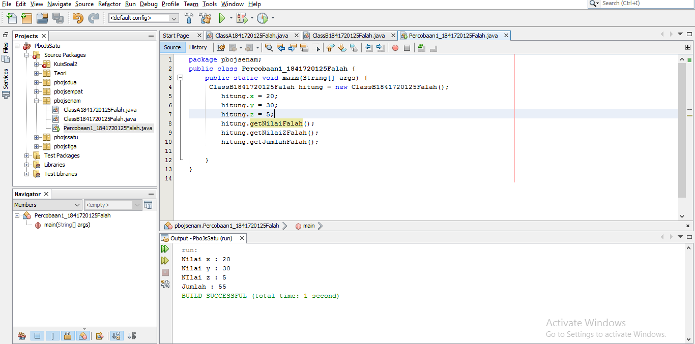

Contoh link kode program : [Percobaan1_1841720125Falah](../../src/6_Inheritance/Percobaan1_1841720125Falah.java)

4.	Jalankan program diatas, kemudian amati apa yang terjadi!

## Pertanyaan

Berdasarkan percobaan 1, jawablah pertanyaan‑pertanyaan yang terkait:

1.	Pada percobaan 1 diatas program yang dijalankan terjadi error, kemudian perbaiki sehingga program tersebut bisa dijalankan dan tidak error!

2.	Jelaskan apa penyebab program pada percobaan 1 ketika dijalankan terdapat error!

Jawab:

1. pada ClassB harus terdapat extends kepada induk classA.

2. terjadi error karena tidak di deklarasikan z,y serta pada classB tidak di tambah i extends

## Percobaan 2 Hak Akses

1.	Buatlah sebuah class parent/superclass dengan nama ClassA.java

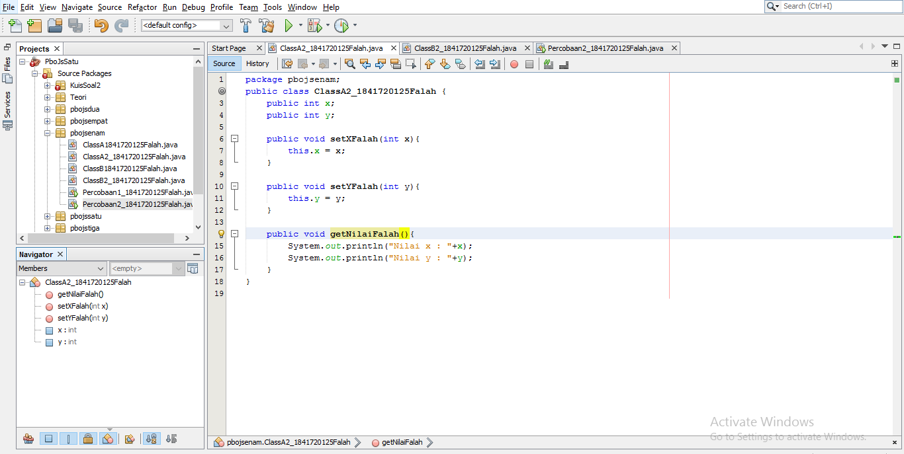

Contoh link kode program : [ClassA2_1841720125Falah](../../src/6_Inheritance/ClassA2_1841720125Falah.java)

2.	Buatlah sebuah class anak/subclass dengan nama ClassB.java

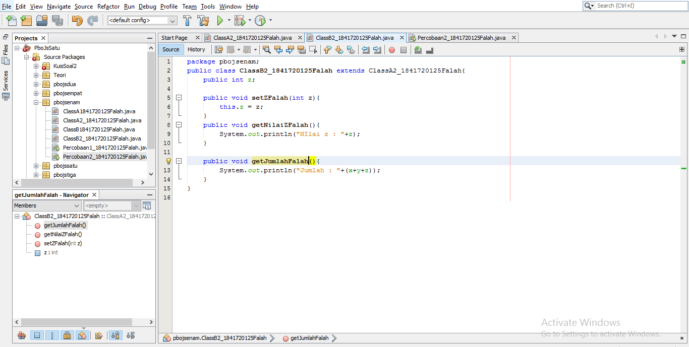

Contoh link kode program : [ClassB2_1841720125Falah](../../src/6_Inheritance/ClassB2_1841720125Falah.java)
3.	Buatlah class Percobaan2.java untuk menjalankan program diatas!

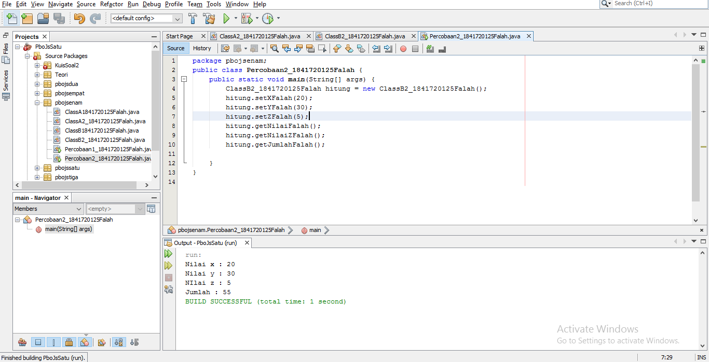

Contoh link kode program : [Percobaan2_1841720125Falah](../../src/6_Inheritance/Percobaan2_1841720125Falah.java)

4.	Jalankan program diatas, kemudian amati apa yang terjadi!

## Pertanyaan

1.	Pada percobaan 2 diatas program yang dijalankan terjadi error, kemudian perbaiki sehingga program tersebut bisa dijalankan dan tidak error

2.	Jelaskan apa penyebab program pada percobaan 1 ketika dijalankan terdapat error!

Jawaban:

1. pada ClassB.java harus terdapat extends kepada induk classA.java

2. Karena pada ClassB tidak di tambah i sehingga percobaan2.java tidak bisa dipanggil

## Percobaan 3 Super

1.	Buatlah sebuah class parent/superclass dengan nama Bangun.java

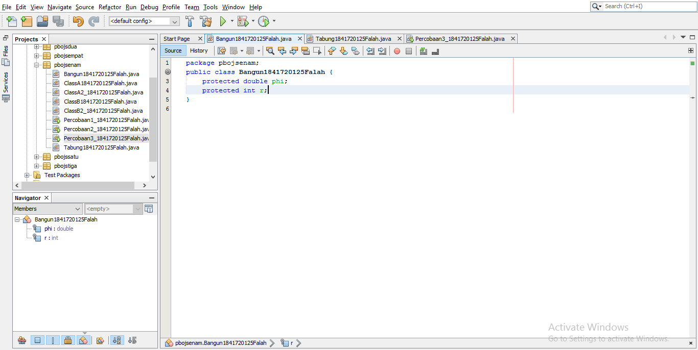

Contoh link kode program : [Bangun1841720125Falah](../../src/6_Inheritance/Bangun_1841720125Falah.java)

2.	Buatlah sebuah class anak/subclass dengan nama Tabung.java

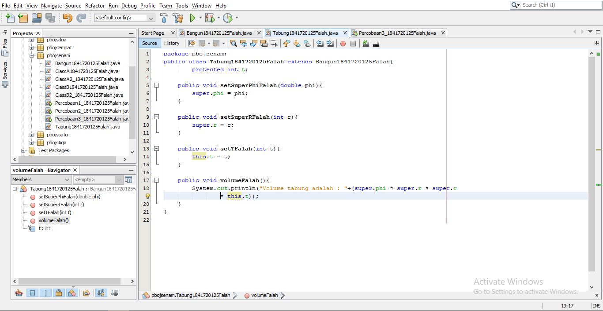

Contoh link kode program : [Tabung1841720125Falah](../../src/6_Inheritance/Tabung_1841720125Falah.java)

3.	Buatlah class Percobaan3.java untuk menjalankan program diatas!

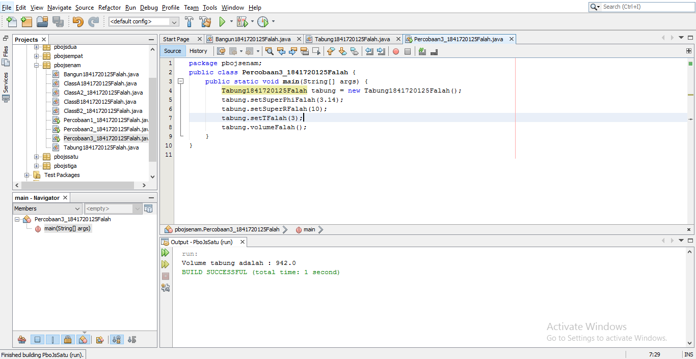

Contoh link kode program : [Percobaan3_1841720125Falah](../../src/6_Inheritance/Percobaan3_1841720125Falah.java)

4.  Jalankan program diatas!

# Pertanyaan
1. Jelaskan fungsi “super” pada potongan program berikut di class Tabung!

2. Jelaskan fungsi “super” dan “this” pada potongan program berikut di class Tabung!

3.	Jelaskan mengapa pada class Tabung tidak dideklarasikan atribut “phi” dan “r” tetapi class tersebut dapat mengakses atribut tersebut!

Jawab:
1. Untuk mempresentasikan object dari class induk

2. Super Untuk mengambil nilai dari kelas induk , sedangkan This untuk mempresentasikan object class itu sendiri 

3. Karena kelas tabung mengambil nilai object dari kelas Bangun.

## Percobaan 4 super contsructor

1.	Buatlah tiga file dengan nama ClassA.java , ClassB.java , dan ClassC.java, seperti pada kode program dibawah ini!

ClassA.java

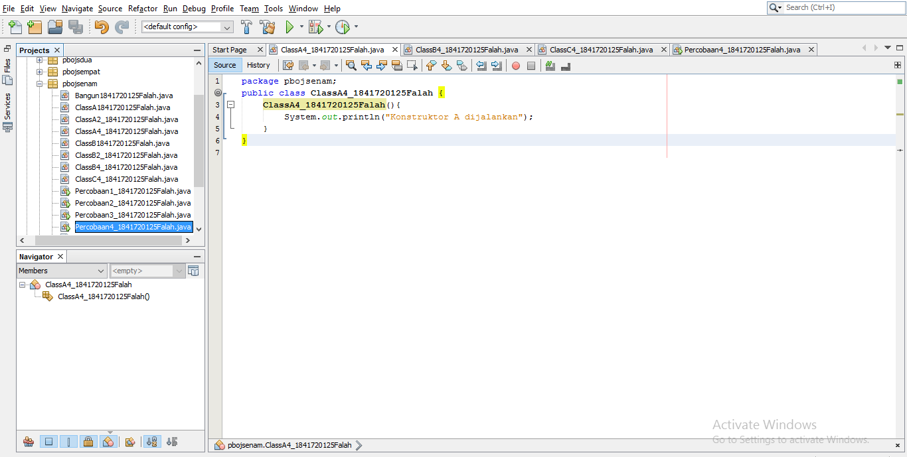

Contoh link kode program : [ClassA4_1841720125Falah](../../src/6_Inheritance/ClassA4_1841720125Falah.java)

ClassB.java

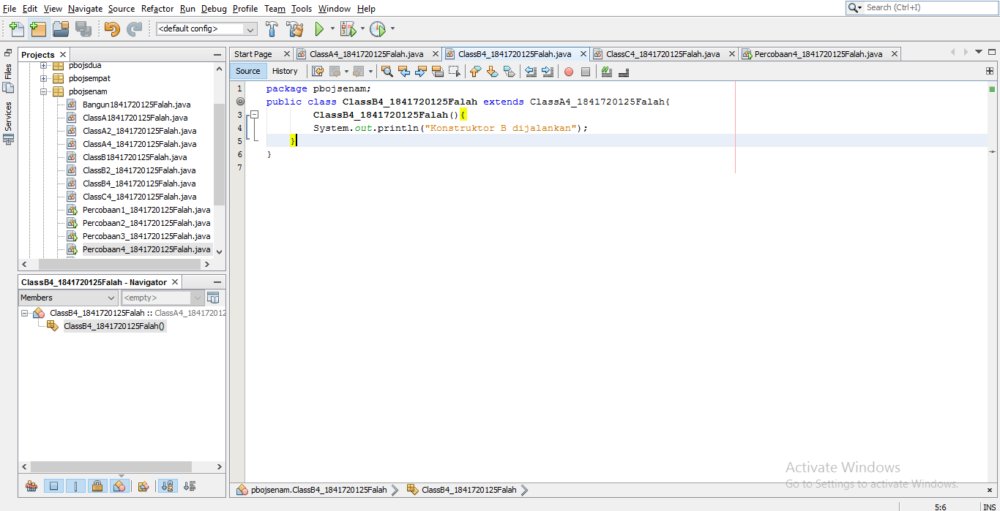

Contoh link kode program : [ClassB4_1841720125Falah](../../src/6_Inheritance/ClassB4_1841720125Falah.java)

ClassC.java

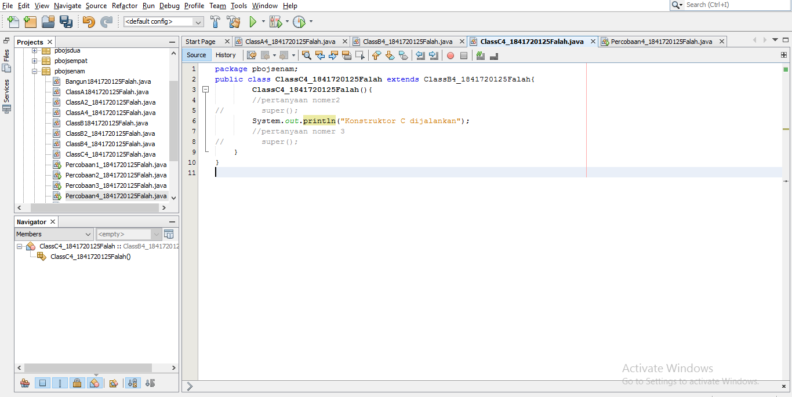

Contoh link kode program : [ClassC4_1841720125Falah](../../src/6_Inheritance/ClassC4_1841720125Falah.java)

2.	Buatlah class Percobaan4.java untuk menjalankan program diatas!

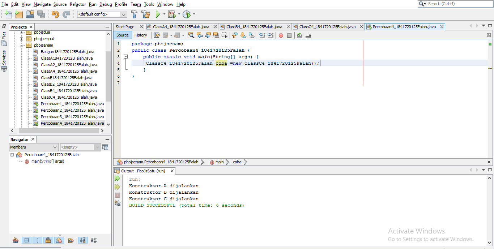

Contoh link kode program : [Percobaan4_1841720125Falah](../../src/6_Inheritance/Percobaan4_1841720125Falah.java)

# Pertanyaan

1.	Pada percobaan 4 sebutkan mana class yang termasuk superclass dan subclass, kemudian jelaskan alasannya!

2.	Ubahlah isi konstruktor default ClassC seperti berikut:
Tambahkan kata super() di baris Pertaman dalam konstruktor defaultnya. Coba jalankan kembali class Percobaan4 dan terlihat tidak ada perbedaan dari hasil outputnya!

3.  Ublah isi konstruktor default ClassC seperti berikut:
Ketika mengubah posisi super() dibaris kedua dalam kontruktor defaultnya dan terlihat ada error. Kemudian kembalikan super() kebaris pertama seperti sebelumnya, maka errornya akan hilang.Perhatikan hasil keluaran ketika class Percobaan4 dijalankan. Kenapa bisa tampil output seperti berikut pada saat instansiasi objek test dari class ClassC
Jelaskan bagaimana urutan proses jalannya konstruktor saat objek test dibuat!

4.  Apakah fungsi super() pada potongan program dibawah ini di ClassC!

Jawaban:

1. Super Class Adalah ClassA 
SubClass nya : ClassB , ClassC 
Karena pada ClassB dan ClassC kita ketikkan Extends untuk mempresentasikan nilai dari induk Class

2. 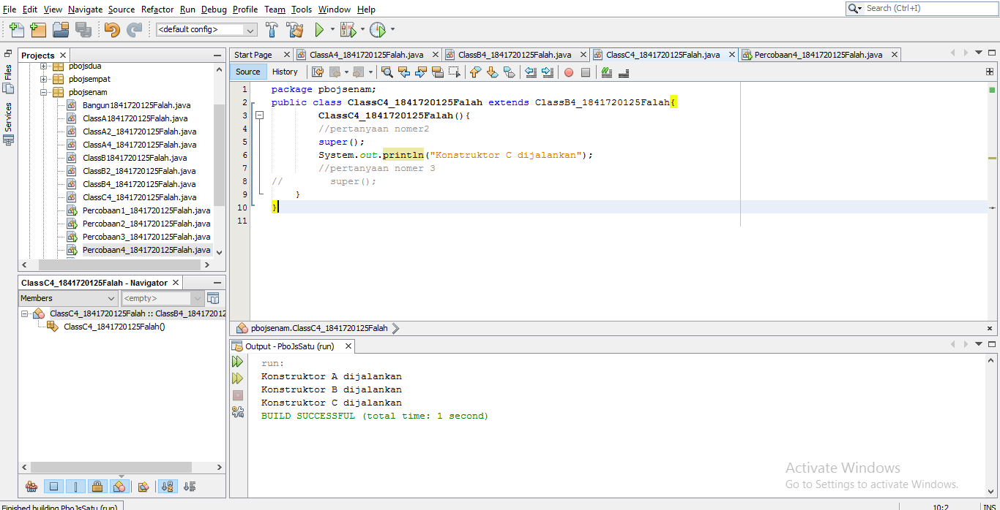

3. 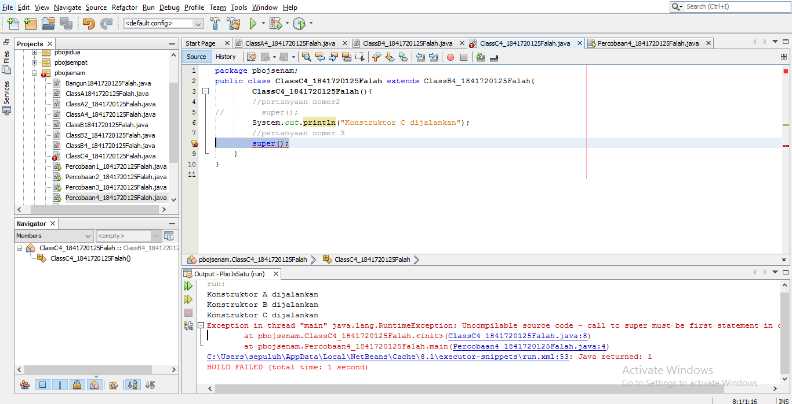

        Urutan konstrakter di awal i dari ClassA (superclass) isi dari Classa di tampilkan kemudian ClassB yang mana Di mana kita tambahkan Extends untuk memanggil fungsi dari kelas lain isi dari ClassB di tampilkan , kemudian pada ClassC di ulangi seperti yang ada di ClassC dan isi dari ClassC di tampilkan atau di jalakankan . yang mana pada Percobaan4(main) di panggil dengan 

4. juga dapat digunakan untuk memanggil method ternetu dari kelas induk.

## Percobaan 5 

1.	Buatlah class Karyawan

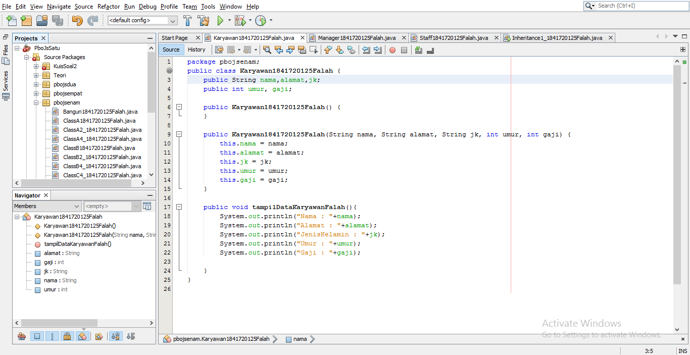

Contoh link kode program : [Karyawan1841720125Falah](../../src/6_Inheritance/Karyawan1841720125Falah.java)

2.	Buatlah class Manager

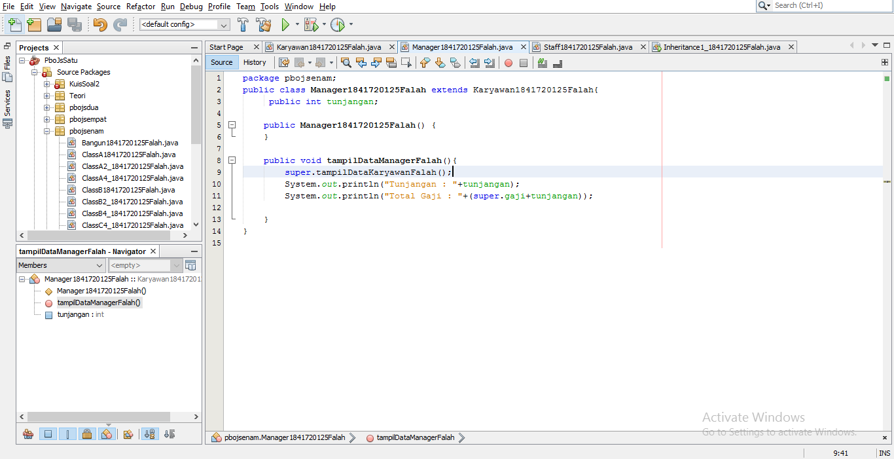

Contoh link kode program : [Manager1841720125Falah](../../src/6_Inheritance/Manager1841720125Falah.java)

3.	Buatlah class Staff

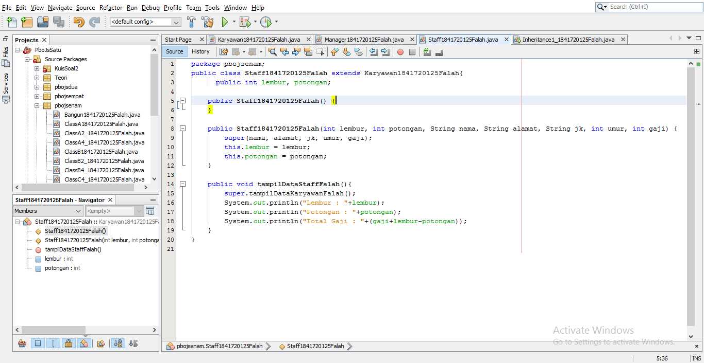

Contoh link kode program : [Staff1841720125Falah](../../src/6_Inheritance/Staff1841720125Falah.java)

4.	Buatlah class inheritance1

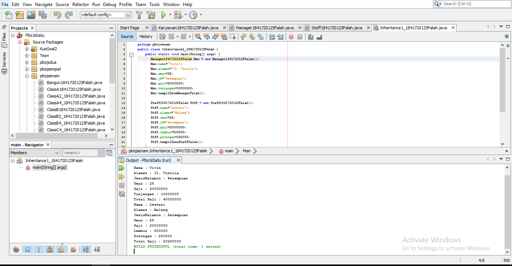

Contoh link kode program : [Inheritance1_1841720125Falah](../../src/6_Inheritance/Inheritance1_1841720125Falah.java)

5. Jalankan program, maka tampilanya adalah sebagai berikut:

# Pertanyaan

1.	Sebutkan class mana yang termasuk super class dan sub class dari percobaan 1 diatas!

2.	Kata kunci apakah yang digunakan untuk menurunkan suatu class ke class yang lain?

3.	Perhatikan kode program pada class Manager, atribut apa saja yang dimiliki oleh class tersebut? Sebutkan atribut mana saja yang diwarisi dari class Karyawan!

4. Jelaskan kata kunci super pada potongan program dibawah ini yang terdapat pada class Manager!

5.	Program pada percobaan 1 diatas termasuk dalam jenis inheritance apa? Jelaskan alasannya!

Jawaban: 

1. Super Class (Karyawan) sedangkan sub Class (Staff, Manager) dengan extends pada classnya dan di ikut i super classnya Karyawan

2. dengan menggunakan Extends untuk menurunkan ke Class yang lainnya

3. Pada ClassManager terdapat attribut : int Tunjagan Attribut pada class Kariyawan : Gaji , yang mana nanti akan di turunkan menjadi Tunjagan pada Class Manager

4. Mewakil i dari kelas induknya yaitu Gaji , sedangkan tunjagan mewakil i kelas Manager 

5. Multilevel Inheritance: Suatu sub class yang menjadi parent class untuk class lainnya.

## Percobaan 6 super contsructor

1.	Berdasarkan program yang sudah anda buat pada percobaan 1 sebelumnya tambahkan dua class yaitu class StaffTetap dan class StaffHarian. Kode Programnya adalah sebagai berikut

Class StaffTetap.java

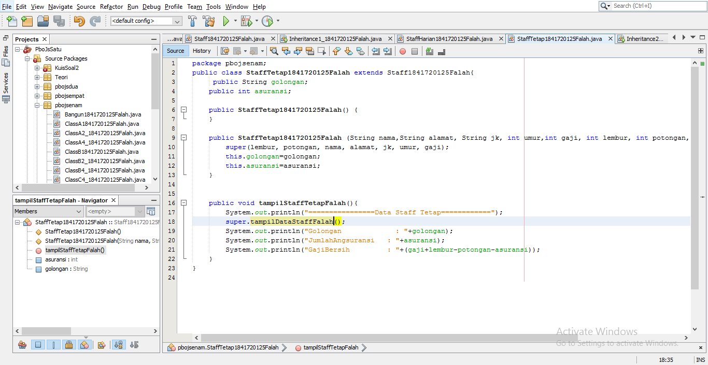

Contoh link kode program : [StaffTetap1841720125Falah](../../src/6_Inheritance/StaffTetap1841720125Falah.java)

Class StaffHarian.java

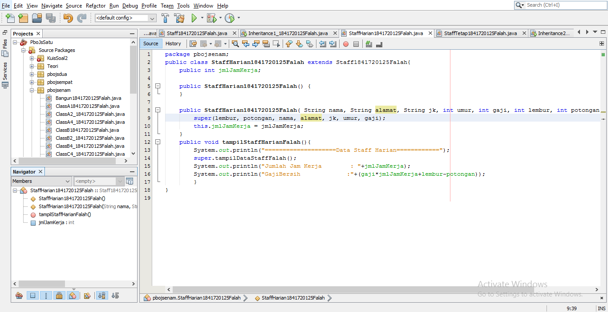

Contoh link kode program : [StaffHarian1841720125Falah](../../src/6_Inheritance/StaffHarian1841720125Falah.java)

2.	Setelah membuat dua class diatas kemudian edit class inheritance2.java menjadi sebagai berikut:

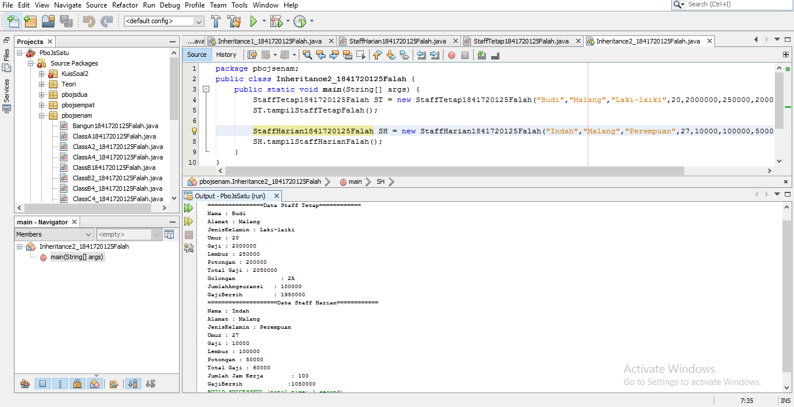

Contoh link kode program : [Inheritance2_1841720125Falah](../../src/6_Inheritance/Inheritance2_1841720125Falah.java)

3.	Jalankan program maka tampilanny adalah sebagai berikut:

# Pertanyaan

1.	Berdasarkan class diatas manakah yang termasuk single inheritance dan mana yang termasuk multilevel inheritance?

2.	Perhatikan kode program class StaffTetap dan StaffHarian, atribut apa saja yang dimiliki oleh class tersebut? Sebutkan atribut mana saja yang diwarisi dari class Staff!

3.	Apakah fungsi potongan program berikut pada class StaffHarian

4.  Apakah fungsi potongan program berikut pada class StaffHarian

5. Perhatikan kode program dibawah ini yang terdapat pada class StaffTetap
Terlihat dipotongan program diatas atribut gaji, lembur dan potongan dapat diakses langsung. Kenapa hal ini bisa terjadi dan bagaimana class StaffTetap memiliki atribut gaji, lembur, dan potongan padahal dalam class tersebut tidak dideklarasikan atribut gaji, lembur, dan potongan?

Jawab

1. Single Inheritance : Pada Percobaan 1 ClassA (Class B mewakili Class B , Class Tabung mewakili Class Tabung)
Multilavel inheritance : pada Percobaan4 (Class B,C mewakili Class A, Class Manager, Staff mewakili Class Karyawan, Staffharian, Stafftetap mewakili Class Staff) 

2. Attribut Class StaffHarian = jumlah jam kerja yang mana attribut ini diwarisi oleh class karyawan (potongan)
Attribut Class StaffTetap = golongan , asuransi yang mana attribut ini diwarisi oleh class karyawan (lembur)

3. untuk memanggil nilai dari dari variabel yang ada di dalam class induk (super class)

4. Karena pada method tampilDatastaff(); menggunakan kata kunci super untuk mengambil nilai dari variable yang ada di jalam sub class

5. Karena pada class StaffTetap kita menggunakan extands untuk memanggil isi yang terdapat di dalam Class Staf yang mana isinya atribut gaji, lembur, dan potongan

## Tugas

1.	Buatlah sebuah program dengan konsep pewarisan seperti pada class diagram berikut ini. Kemudian buatlah instansiasi objek untuk menampilkan data pada class Mac, Windows dan Pc!.

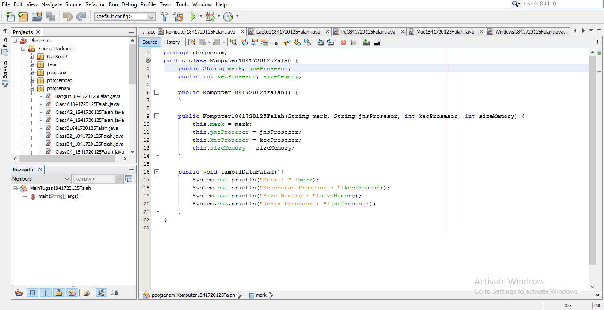

Contoh link kode program : [Komputer1841720125Falah](../../src/6_Inheritance/Komputer1841720125Falah.java)

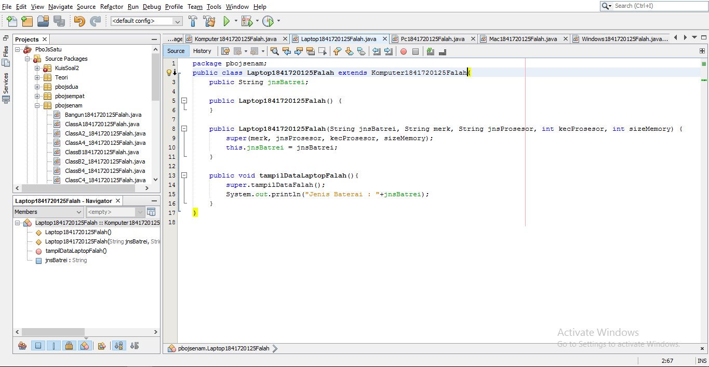

Contoh link kode program : [Laptop1841720125Falah](../../src/6_Inheritance/Laptop1841720125Falah.java)

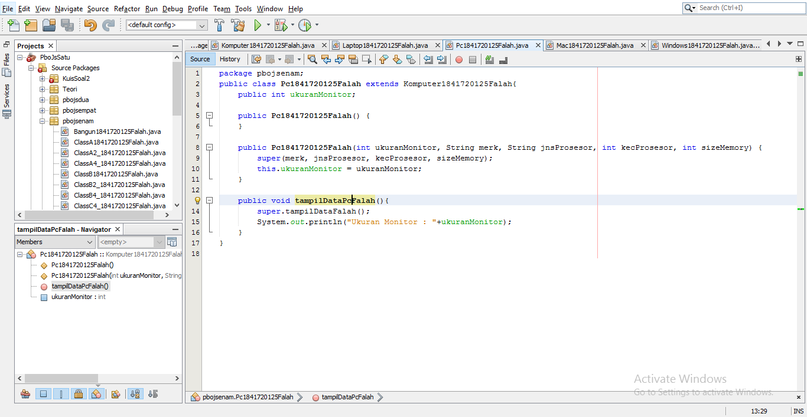

Contoh link kode program : [Pc1841720125Falah](../../src/6_Inheritance/Pc1841720125Falah.java)

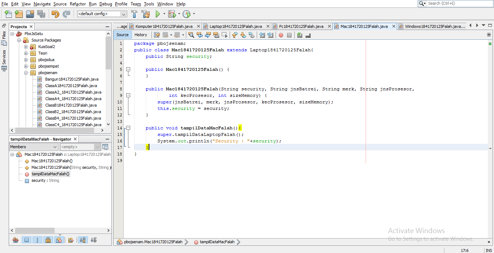

Contoh link kode program : [Mac1841720125Falah](../../src/6_Inheritance/Mac1841720125Falah.java)

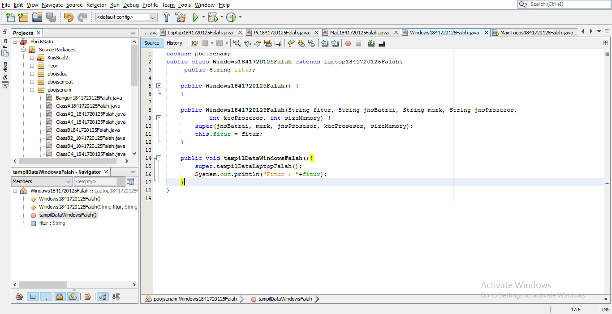

Contoh link kode program : [Windows1841720125Falah](../../src/6_Inheritance/Windows_1841720125Falah.java)

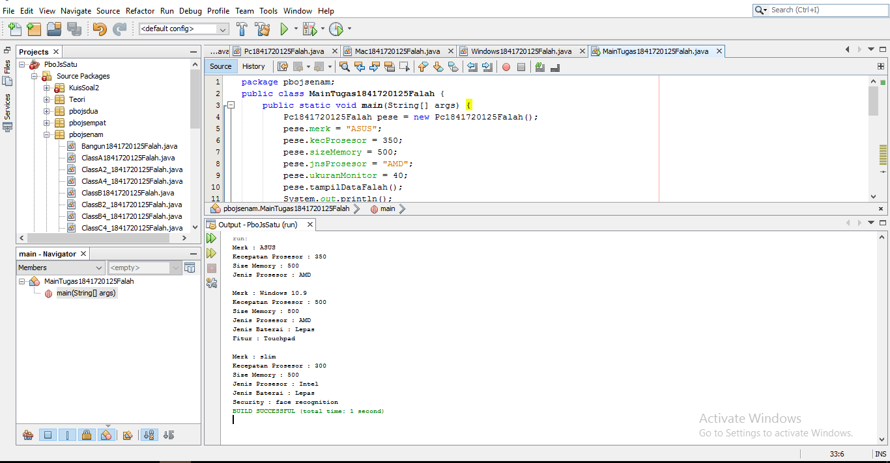

Contoh link kode program : [MainTugas1841720125Falah](../../src/6_Inheritance/MainTugas1841720125Falah.java)

## Kesimpulan
Di Jobsheet ini Kita Dapat Memahami konsep dasar inheritance atau pewarisan Mampu membuat suatu subclass dari suatu superclass tertentu, Mampu mengimplementasikan konsep single dan multilevel inheritance dan Mampu membuat objek dari suatu subclass dan melakukan pengaksesan terhadap atribut dan method baik yang dimiliki sendiri atau turunan dari superclass nya.

## Pernyataan Diri

Saya menyatakan isi tugas, kode program, dan laporan praktikum ini dibuat oleh saya sendiri. Saya tidak melakukan plagiasi, kecurangan, menyalin/menggandakan milik orang lain.

Jika saya melakukan plagiasi, kecurangan, atau melanggar hak kekayaan intelektual, saya siap untuk mendapat sanksi atau hukuman sesuai peraturan perundang-undangan yang berlaku.

Ttd,

***(AHMAD FALAH SABILA)***
