# Laporan Praktikum #7 - Overloading dan Overriding

## Kompetensi

Setelah menempuh pokok bahasan ini, mahasiswa mampu :
a. Memahami konsep overloading dan overriding,

b. Memahami perbedaan overloading dan overriding,

c. Ketepatan dalam mengidentifikasi method overriding dan overloading

d. Ketepatan dalam mempraktekkan instruksi pada jobsheet

e. Mengimplementasikan method overloading dan overriding.

## Ringkasan Materi
 Di Jobsheet ini Kita Dapat Memahami konsep dan perbedaan overloading dan overriding serta ketepatan dalam mengidentifikasi method overriding dan overloading dan juga dalam mempraktekkan instruksi pada jobsheet dan yang terakhir mengimplementasikan method overloading dan overriding.

## Percobaan 1
Untuk kasus contoh berikut ini, terdapat tiga kelas, yaitu Karyawan, Manager, dan Staff. Class Karyawan merupakan superclass dari Manager dan Staff dimana subclass Manager dan Staff memiliki method untuk menghitung gaji yang berbeda.

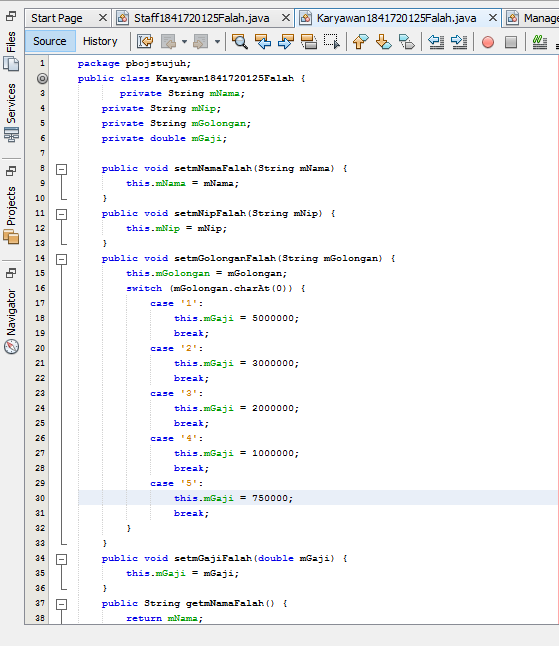

Contoh link kode program : [Karyawan1841720125Falah](../../src/7_Overriding_dan_Overloading/Karyawan1841720125Falah.java)

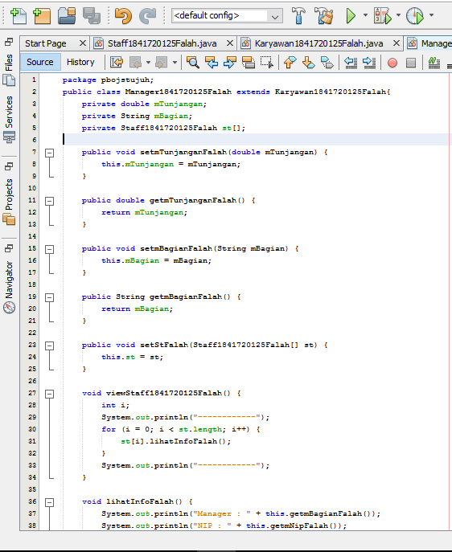

Contoh link kode program : [Manager1841720125Falah](../../src/7_Overriding_dan_Overloading/Manager1841720125Falah.java)

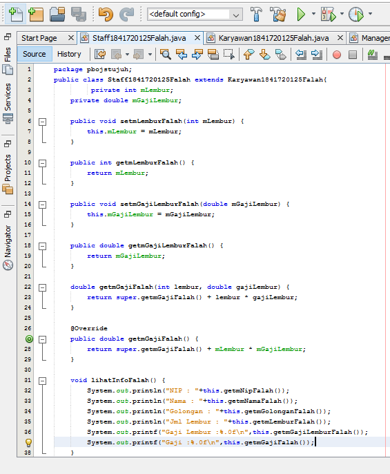

Contoh link kode program : [Staff1841720125Falah](../../src/7_Overriding_dan_Overloading/Staff1841720125Falah.java)

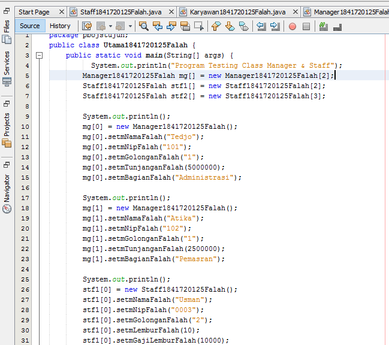

Contoh link kode program : [Utama1841720125Falah](../../src/7_Overriding_dan_Overloading/Utama1841720125Falah.java)

### OUTPUTNYA:

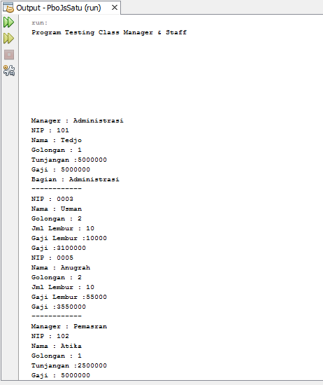

## Latihan

Contoh link kode program : [PerkalianKu1841720125Falah](../../src/7_Overriding_dan_Overloading/PerkalianKu1841720125Falah.java)

4.1 Dari source coding diatas terletak dimanakah overloading ?

### Jawab : 

4.2 Jika terdapat overloading ada berapa jumlah parameter yag berbeda.

### Jawab : 
        ada 1 parameter yang berbeda yaitu pada "int c".

Contoh link kode program : [PerkalianKu1841720125Falah](../../src/7_Overriding_dan_Overloading/PerkalianKu1841720125Falah.java)

4.3 Dari source coding diatas terletak dimanakah overloading?

### Jawab : 

4.4 Jika terdapat overloading ada berapa tipe parameter yang berbeda ?

### Jawab :
         terdapat 4 parameter berbeda yaitu int a, int b dan double a, double b.

Contoh link kode program : [FishFalah](../../src/7_Overriding_dan_Overloading/FishFalah.java)

4.5 Dari source coding diatas terletak dimanakah overriding ? 
### Jawab :

4.6 Jabarkan apabila sourcoding diatas jika terdapat overriding? 

### Jawab : 
        Deklarasi method pada subclass PiranhaFalah sama dengan method superclass Ikan1841720125Falah

## Tugas

### 5.1 Overloading

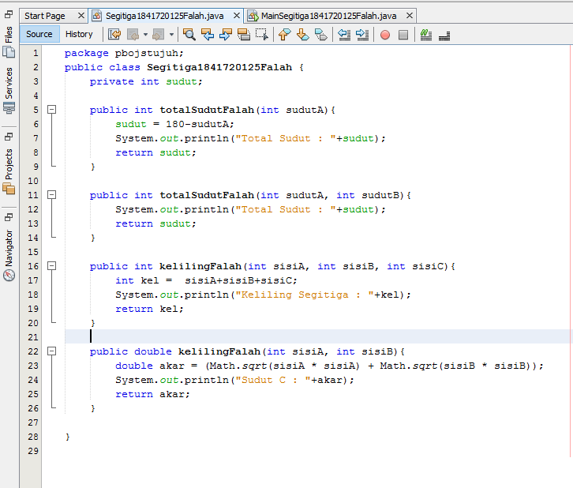

Contoh link kode program : [Segitiga1841720125Falah](../../src/7_Overriding_dan_Overloading/Segitiga1841720125Falah.java)

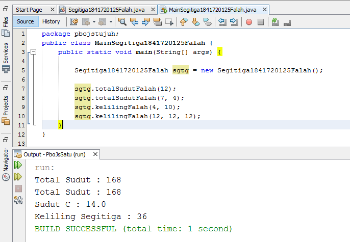

Contoh link kode program : [MainSegitiga1841720125Falah](../../src/7_Overriding_dan_Overloading/MainSegitiga1841720125Falah.java)

### Overriding

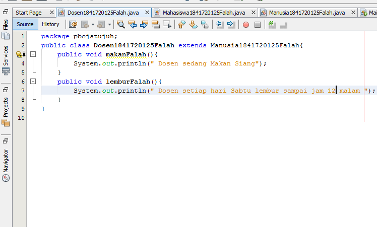

Contoh link kode program : [Dosen1841720125Falah](../../src/7_Overriding_dan_Overloading/Dosen1841720125Falah.java)

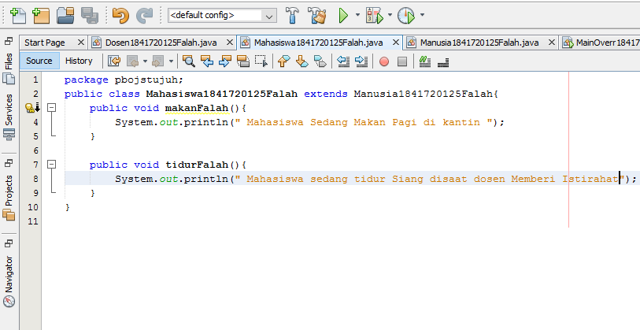

Contoh link kode program : [Mahasiswa1841720125Falah](../../src/7_Overriding_dan_Overloading/Mahasiswa1841720125Falah.java)

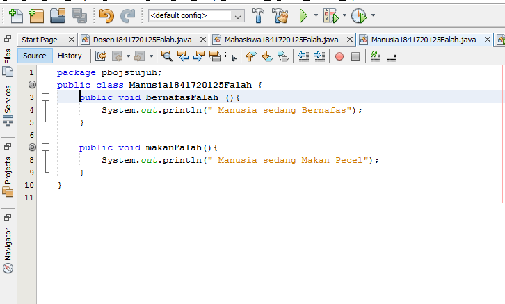

Contoh link kode program : [Manusia1841720125Falah](../../src/7_Overriding_dan_Overloading/Manusia1841720125Falah.java)

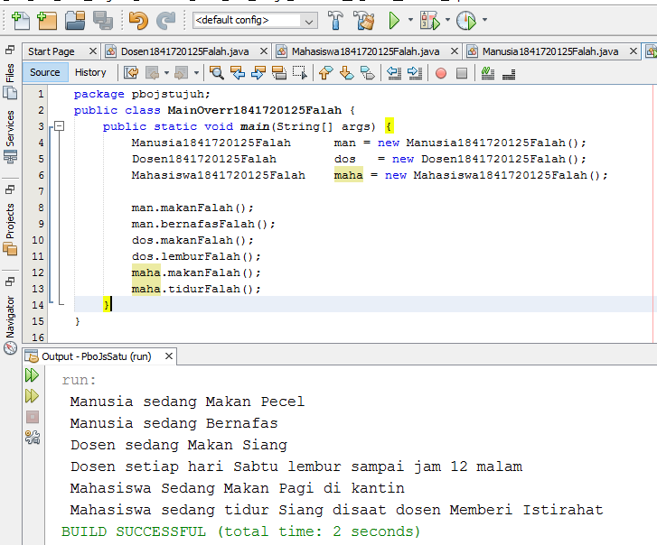

Contoh link kode program : [MainOverr1841720125Falah](../../src/7_Overriding_dan_Overloading/MainOverr1841720125Falah.java)

## Kesimpulan
Di Jobsheet ini Kita Dapat Memahami konsep dan perbedaan overloading dan overriding serta ketepatan dalam mengidentifikasi method overriding dan overloading dan juga dalam mempraktekkan instruksi pada jobsheet dan yang terakhir mengimplementasikan method overloading dan overriding.

## Pernyataan Diri

Saya menyatakan isi tugas, kode program, dan laporan praktikum ini dibuat oleh saya sendiri. Saya tidak melakukan plagiasi, kecurangan, menyalin/menggandakan milik orang lain.

Jika saya melakukan plagiasi, kecurangan, atau melanggar hak kekayaan intelektual, saya siap untuk mendapat sanksi atau hukuman sesuai peraturan perundang-undangan yang berlaku.

Ttd,

***(AHMAD FALAH SABILA)***
